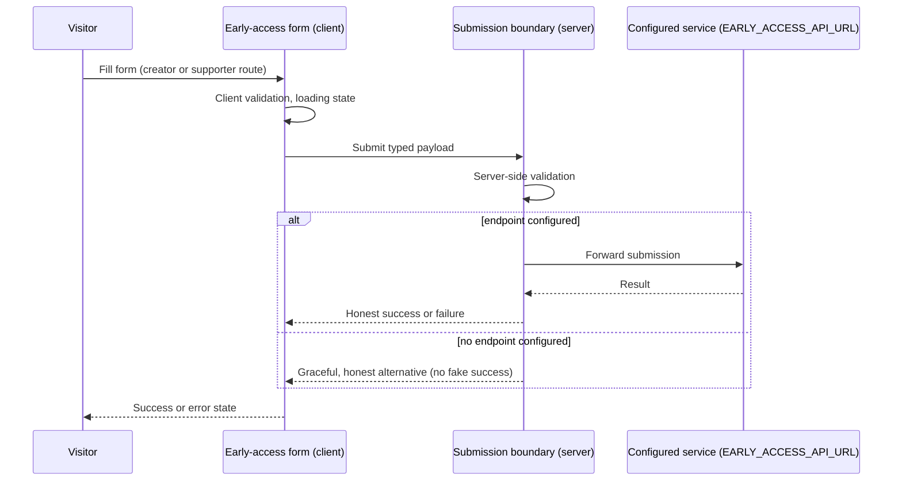

# 6. Runtime View

> Planned flows — verify against the implementation once it exists.

## Scenario 1: Visitor loads a public page

1. Visitor requests a route (e.g. `/for-creators`).
2. Vercel serves the statically generated or server-rendered page.
3. Metadata (title, description, canonical, Open Graph, structured data) is produced server-side as part of the render.
4. Minimal client JavaScript hydrates only interactive leaves (mobile menu, accordions, form).

## Scenario 2: Visitor submits early-access interest

Failure is shown honestly; nothing is logged that contains personal data.

## Scenario 3: Search engine crawls the site

1. Crawler fetches `robots.txt`, then the sitemap.
2. Each URL returns fully server-rendered content; structured data matches visible copy.
