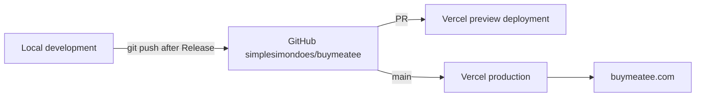

# 7. Deployment View

> Planned — the repository is not yet connected to Vercel and contains no deployable code. Update after first deployment.

- **GitHub repository** — `simplesimondoes/buymeatee`, default branch `main`. Pushes happen only through the [release workflow](../.ai/workflows/release.md).
- **Vercel previews** — every PR gets a preview URL; visual/release verification happens there.
- **Production** — deploys from `main`; domain `buymeatee.com` configured in Vercel (DNS details to be documented once set up).
- **Environment variables** — set in Vercel project settings (`NEXT_PUBLIC_SITE_URL`, `EARLY_ACCESS_API_URL`, plus future values); mirrored as safe placeholders in `.env.example`. No secrets in the repository.
- **Rollback** — Vercel instant rollback (promote a previous deployment). Document the exact procedure after the first production deploy.
